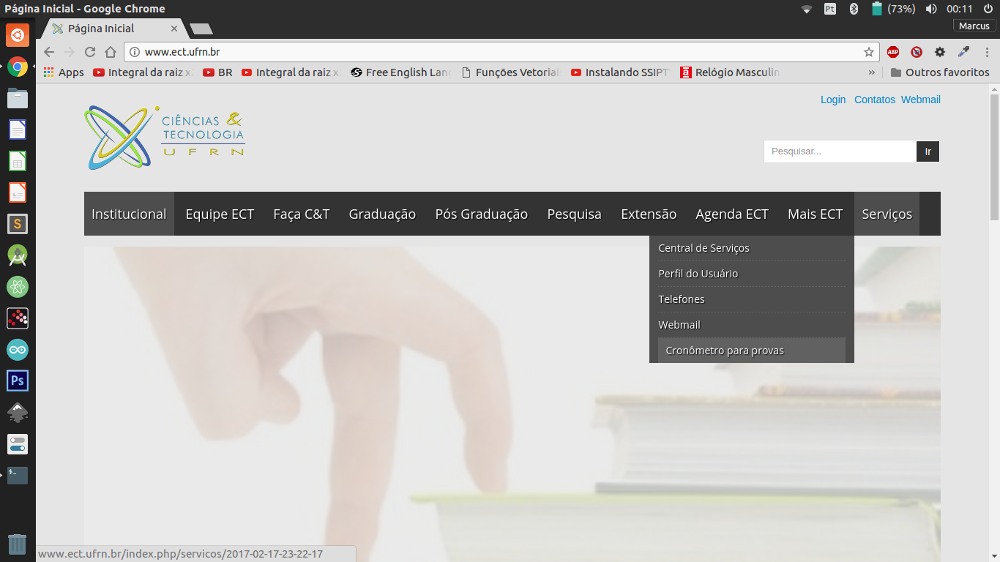
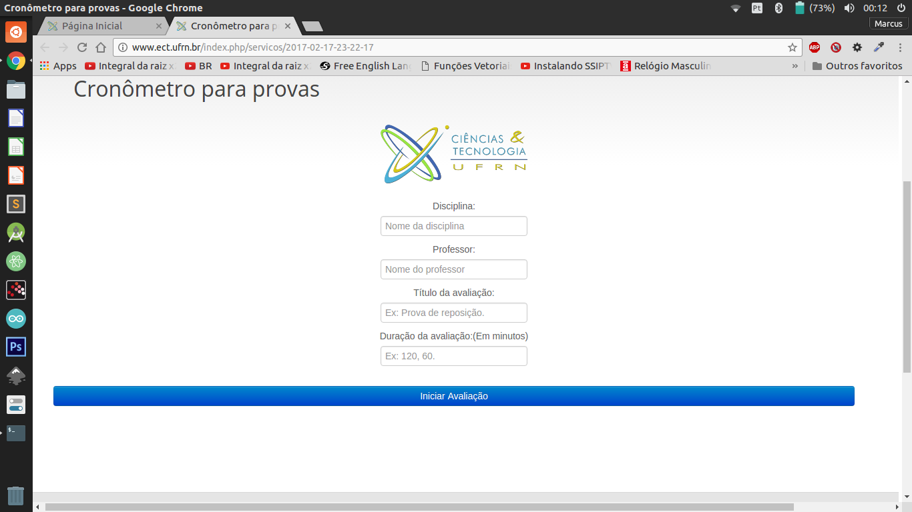
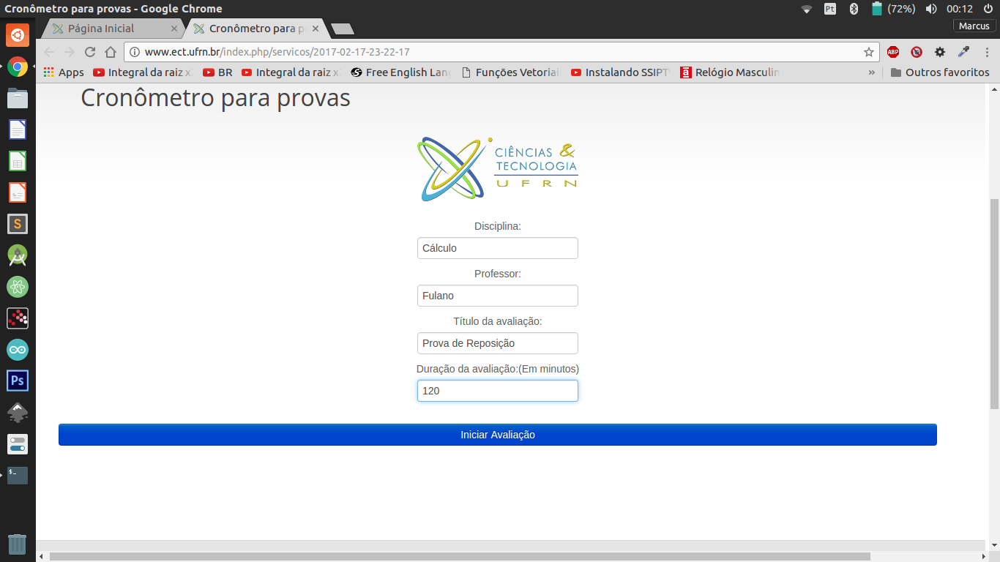
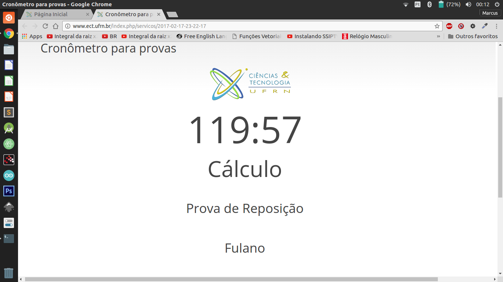

# Stopwatch for tests
This chronometer is used in tests, assessments and tasks of the School of Sciences and Technology (ECT) at the Federal University of Rio Grande do Norte (UFRN).

The project was created with the intention of improving and optimizing the process of showing evidence time for the teachers of this department, since the time was shown in some sites full of propaganda which was quite uncomfortable.

#### Below you can see the project location on my department website (http://www.ect.ufrn.br/):

- On the ECT website you can go to services and look at Chronometer for tests, click on it:

- Now we have the following screen:

- We fill in the data:

- Finally we have:

Questions or suggestions:

mpsdantas15@gmail.com

# Cronômetro para provas
Este cronômetro é utilizado em provas, avaliações e tarefas da Escola de Ciências e Tecnologia (ECT) na Universidade Federal do Rio Grande do Norte (UFRN).

O projeto foi criado com um intuito de melhorar e otimizar o processo de exibição de tempo de provas para os professores desse departamento, visto que o tempo era mostrado em alguns sites cheios de propaganda o que era bastante incomodo.

#### Abaixo pode ser visto a localização do projeto no site do meu departamento (http://www.ect.ufrn.br/):

- No site da ECT você pode ir em serviços e observar a opção Crônometro para provas, clique nele:

- Agora temos a seguinte tela:

- Preenchemos os dados:

- Por fim temos:

Duvidas ou sugestões:

mpsdantas15@gmail.com

